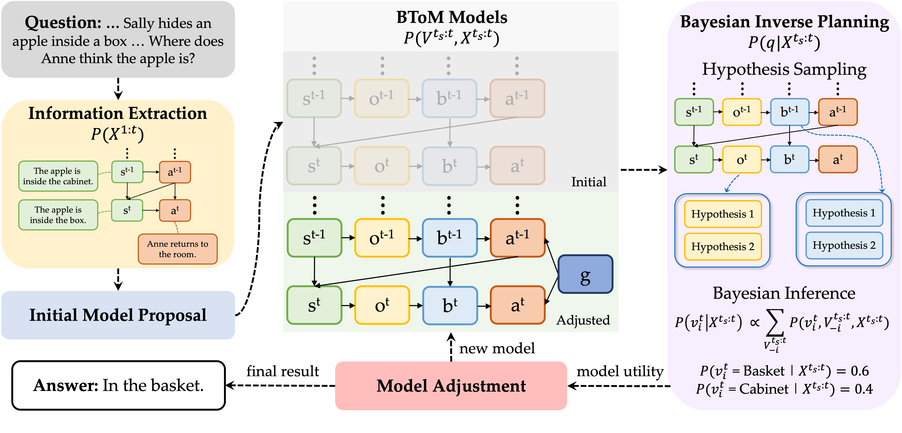

## AutoToM: Automated Bayesian Inverse Planning and Model Discovery<br>for Open-ended Theory of Mind
### [Paper](https://arxiv.org/abs/2502.15676) | [Project Page](https://chuanyangjin.com/AutoToM)

We propose AutoToM, an automated Bayesian Inverse Planning and Model Discovery for Open-ended Theory of Mind. 



## Example Usage

*To run AutoToM on MMToM-QA, with the default settings of reduced hypotheses and backwards inference*: 

    python ProbSolver.py --automated --dataset_name "MMToM-QA"

*To run AutoToM on ToMi-1st with a specified model input*: 

    python ProbSolver.py --dataset_name "ToMi-1st" --assigned_model "['State', 'Observation', 'Belief']"

## Testing AutoToM with customized questions

Please check out ``playground.ipynb``

## Requirements

- Install relevant packages:
    - run
    ``
        pip install -r requirements.txt
    ``
- Set your `OPENAI_API_KEY`:

    - On macOS and Linux:
    `export OPENAI_API_KEY='your-api-key'`
    
    - On Windows: `set OPENAI_API_KEY='your-api-key'`

## Citation

If you find the our paper and code useful, consider citing it:

```bibtex
@misc{zhang2025autotomautomatedbayesianinverse,
      title={AutoToM: Automated Bayesian Inverse Planning and Model Discovery for Open-ended Theory of Mind}, 
      author={Zhining Zhang and Chuanyang Jin and Mung Yao Jia and Tianmin Shu},
      year={2025},
      eprint={2502.15676},
      archivePrefix={arXiv},
      primaryClass={cs.AI},
      url={https://arxiv.org/abs/2502.15676}, 
}
```
